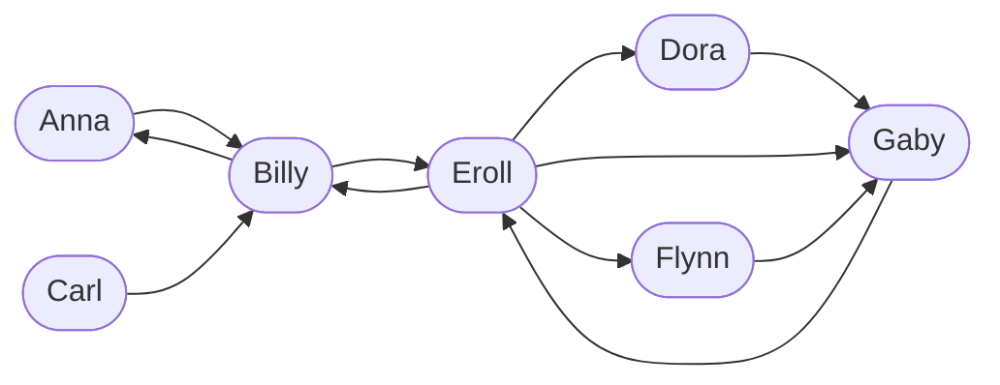

On considère le schéma suivant où une flèche allant d'une personne Α vers une
personne B indique que la personne A « suit » la personne B sur son compte
*Immediam*. On dit alors que B est un *ami* de A.

Voici un exemple de réseau *Immediam* :


On représente ce réseau *Immediam* en machine par un dictionnaire dans lequel :

- les clés sont les chaînes de caractères correspondant aux noms des personnes inscrites, 
  
- les valeurs associées sont des listes de chaînes de caractères, représentant les personnes suivies.


Écrire une fonction  `amis_d_amis(reseau, membre)` qui :

- prend en argument un dictionnaire `reseau` représentant un tel réseau *Immediam* et une chaîne de caractères
`membre` qui représente un membre du réseau
- et qui renvoie la liste des amis des amis de `membre`, à l'exclusion de lui-même et sans doublon. 


!!! example "Exemples"

    ```python
    >>> immediam = {
            "Anna": ["Billy"],
            "Billy": ["Anna", "Eroll"],
            "Carl": ["Billy"],
            "Dora": ["Gaby"],
            "Eroll": ["Billy", "Dora", "Flynn", "Gaby"],
            "Flynn": ["Gaby"],
            "Gaby": ["Eroll"],
    }
    >>> amis_d_amis(immediam, 'Billy')
	['Dora', 'Flynn', 'Gaby']
    >>> amis_d_amis(immediam, 'Eroll')
	['Anna', 'Gaby']
	>>> amis_d_amis(immediam, 'Dora')
	['Eroll']
    ```

{{ IDE('exo') }}
