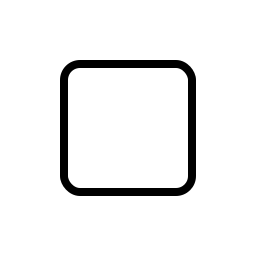
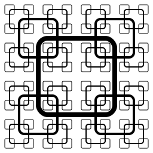
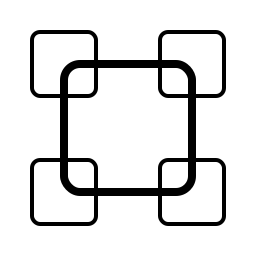
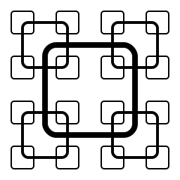

# 📐 Carrés aux 4 coins

Un exercice de construction de figure géométrique dans le plan.

!!! info "Classe `Figure`"

    ```python
    fig = Figure(x_min=-4, y_min=-4, x_max=+4, y_max=+4, width=256)
    ```

    On peut alors dessiner dans le plan euclidien avec un repère orthonormé.
    
    - On indique une zone de dessin.
    - On indique aussi la taille de l'image produite, en pixels, soit en largeur (`width`), soit en hauteur (`height`). Le ratio est conservé.

    Cette classe `Figure` est spécifique à cet exercice.


Pour cet exercice, seule la fonction de construction `square` est disponible. 


!!! info "La fonction `square`"
     `#!py square(x, y, a)` définit un carré de centre $(x, y)$ et de côté $a$

    - les coins des carrés sont arrondis, uniquement dans un but esthétique
    - l'épaisseur du trait est automatiquement proportionnelle au côté

!!! example "Un exemple"

    - La méthode `draw` de `Figure` ajoute un élément au dessin.
    - La méthode `done` construit et affiche le dessin de la figure.
    - Le résultat est une image vectorielle.

    Par exemple, le script

    ```python
    fig = Figure(x_min=-4, y_min=-4, x_max=+4, y_max=+4, width=256)

    fig.draw(square(0, 0, 4))

    fig.done()
    ```

    dessine un carré de centre $(0, 0)$ et de côté $4$, ce qui produit l'image suivante

    

    


!!! question "Exercice"
    On vous demande de compléter la fonction récursive `motif_carre_4` telle que le script à compléter produise l'image suivante

    { .autolight }

    - Le plus grand carré est de côté 4, de centre $(0, 0)$.
    - Les centres des petits carrés sont aux coins du grand carré associé,
        - le rapport de réduction est alors $\frac12$.
    - Il y a 4 tailles différentes de carrés.


    La fonction sera obligatoirement récursive.

{{ IDE('exo') }}


<p style="border:solid 1px black;margin:auto;" id="fig_geometry">Votre image sera ici</p>

??? tip "Indice"

    === "Avec n = 1"
        

        ```python
        motif_carre_4(0, 0, 4, 1)
        ```

    === "Avec n = 2"
        

        ```python
        motif_carre_4(0, 0, 4, 2)
        ```

    === "Avec n = 3"
        

        ```python
        motif_carre_4(0, 0, 4, 3)
        ```

    === "Avec n = 4"
        
        
        ```python
        motif_carre_4(0, 0, 4, 4)
        ```
