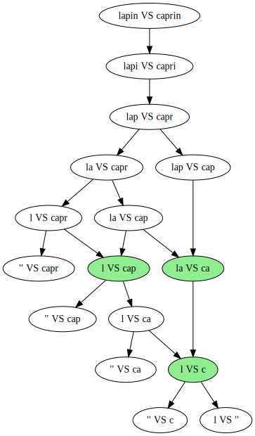

# Différences entre deux chaînes de caractères

## Objectif

Considérons les deux phrases suivantes : 

**merssi de respecté l'ortaugrafe !**

**Merci de respecter l'orthographe !**

A quel point sont-elles proches ?

Pour répondre à cette question, on va chercher quelle est la *plus longue sous-chaîne commune* à ces deux phrases.

!!! warning "Attention"

    On cherche dans cet exercice une **succession** des caractères identiques :
  
    * **pas forcément à la même position** dans chaque texte
  
    *  **sans tenir compte des caractères différents intermédiaires**
    
    **Il ne s'agit donc pas** d'une simple comparaison des caractères aux mêmes indices dans chaque texte


 La comparaison des deux phrases donne ceci (sur fond vert les caractères "identiques", sur fond rouge les différents) :

<p style="letter-spacing: 3px"><span style="color:black;background-color:#FF7276">m</span><span style="color:black;background-color:#90EE90">er</span><span style="color:black;background-color:#FF7276">ss</span><span style="color:black;background-color:#90EE90">i de respect</span><span style="color:black;background-color:#FF7276">é</span><span style="color:black;background-color:#90EE90"> l'ort</span><span style="color:black;background-color:#FF7276">au</span><span style="color:black;background-color:#90EE90">gra</span><span style="color:black;background-color:#FF7276">f</span><span style="color:black;background-color:#90EE90">e !</span></p>

<p style="letter-spacing: 3px"><span style="color:black;background-color:#FF7276">M</span><span style="color:black;background-color:#90EE90">er</span><span style="color:black;background-color:#FF7276">c</span><span style="color:black;background-color:#90EE90">i de respect</span><span style="color:black;background-color:#FF7276">er</span><span style="color:black;background-color:#90EE90"> l'ort</span><span style="color:black;background-color:#FF7276">ho</span><span style="color:black;background-color:#90EE90">gra</span><span style="color:black;background-color:#FF7276">ph</span><span style="color:black;background-color:#90EE90">e !</span></p>

La plus longue sous-chaîne commune est formée en assemblant les caractères sur fond vert **sans tenir compte de ceux sur fond rouge** :

<p style="letter-spacing: 3px"><span style="color:black;background-color:#90EE90">eri de respect l'ortgrae !</span></p>

Présentée différemment, en plaçant un `_` à la place de chaque caractère différent entre les deux chaînes, on obtient :

    1ère phrase :   merssi de respecté l'ortaugrafe !
                    _er__i de respect_ l'ort__gra_e !

    2ème phrase :   Merci de respecter l'orthographe !
                    _er_i de respect__ l'ort__gra__e !

Ici, la plus longue sous-chaîne est formée en assemblant les caractères différents de `_`. On retrouve bien dans les deux cas `eri de respect l'ortgrae !`

## Démarche

Nous allons lire les deux phrases de **droite à gauche**.

Trois cas se présentent à nous :

1. L'une des deux phrases est vide : la plus longue sous-chaîne commune est elle aussi vide

2. Le dernier caractère dans chaque phrase est identique : il termine la plus longue sous-chaîne et l'on peut reprendre l'étude sur les deux phrases privées de ce dernier caractère

3. Le dernier caractère dans chaque phrase est différent, il faut étudier deux cas de figure :
    1. On compare la première phrase privée du dernier caractère et la seconde complète
    2. On compare la première phrase complète et la seconde privée du dernier caractère
    3. On conserve la comparaison renvoyant la sous-chaîne la plus longue

!!! example "Exemple"

    On souhaite comparer les mots `lapin` et `caprin` :

    * la dernière lettre est identique, la sous-chaîne se terminera par `n` et on compare `lapi` et `capri`
    * la dernière lettre est identique, la sous-chaîne se terminera par `in` et on compare `lap` et `capr`
    * la dernière lettre diffère :
        * on compare `la` et `capr`. La plus longue sous-chaîne est `a`
        * on compare `lap` et `cap`. La plus longue sous-chaîne est `ap`
        * la deuxième comparaison est plus longue : on la conserve
    * en "ajoutant" ce résultat au précédent, on obtient la plus longue sous-chaîne : `apin`

## Échauffement : `sans_dernier`

Écrire la fonction `sans_dernier` prenant en argument une chaîne de caractères `texte` et renvoyant **une nouvelle chaîne de caractères** comprenant les mêmes caractères que `texte` sauf le dernier.

{{ IDE('exo_sans_dernier') }}

## Intermède : *mémoïsation*  ?

La figure ci-dessous représente la succession des comparaisons effectuées dans l'exemple "`lapin` *VS* `caprin`".

{ width='50%'}

Comme on peut le voir, certaines comparaisons (en vert) sont effectuées plusieurs fois lors de l'exécution de l'algorithme. Et ce bien que les deux textes à comparer soient relativement courts...

Afin d'éviter d'effectuer ces répétitions, on va garder trace des résultats des comparaisons déjà effectuées dans un dictionnaire Python.

!!! note "Remarque"

    Cette approche consistant à garder trace des résultats précédents s'appelle la *mémoïsation*

Ce dictionnaire sera construit sur le modèle suivant : `memoire = { (texte1, texte2) : plus_longue_sous_chaîne_commune}`.

Dans l'exemple "`lapin` *VS* `caprin`" en fin d'exécution le dictionnaire sera (on n'en donne qu'une partie) :

```python
memoire = {('l', 'c'): '', ..., ('lapi', 'capri'): 'api', ('lapin', 'caprin'): 'apin'}
```

Comme on peut le voir :

* `memoire[('l', 'c')]` vaut `''`. En effet les textes `'l'` et `'c'` n'ont aucun caractère en commun
* `memoire[('lapi', 'capri')]` vaut `'api'`. La plus longue sous-chaîne commune des textes `'lapi'` et `'capri'` est `api` 
* `memoire[('lapin', 'caprin')]` vaut `'apin'` : on retrouve le résultat attendu

Le dictionnaire sera créé dans le corps du programme et initialement vide.

A chaque comparaison, on vérifiera que le couple `(texte1, texte2)` est présent dans le dictionnaire :

* si oui, on renverra directement la valeur
* si non, il faudra :
    * comparer les deux textes à l'aide de l'algorithme
    * insérer le résultat de cette comparaison dans le dictionnaire (en prévision d'une future comparaison identique)
    * le renvoyer

## Au travail !

Compléter la fonction `plus_longue_sous_chaine` ci-dessous.

Il s'agit d'une fonction récursive prenant en argument les deux textes à comparer et renvoyant leur plus longue sous-chaîne commune.

On n'oubliera pas de remplir le dictionnaire `memoire` au fil de la fonction.

{{ IDE('exo_plsc') }}
