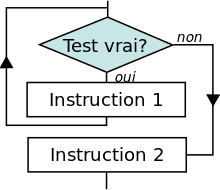

# La boucle non bornée : Tant_que... Fin_Tant_que
## Introduction et définition

!!! warning "Cours"
     __Définition : la boucle *Tant_que* est une structure de contrôle permettant d'exécuter un ensemble d'instructions de façon répétée sur la base d'une précondition booléenne.__
    
On utilise une __boucle non bornée *Tant_que* (`while` en Python)__ lorsqu'on ne connaît pas exactement le nombre de tâches répétitives que le programme doit exécuter. On parle aussi de __boucle à précondition__. C'est cette précondition qui déterminera si le bloc d'instructions contenu dans la boucle doit être exécuté.

Voici une écriture d'une boucle non bornée en __pseudo-code__ :

!!! warning "Cours"
    TANT_QUE condition  
    &emsp;Bloc d'instructions  
    FIN_TANT_QUE
    
En voici un __algorigramme__ :


On retiendra qu'__en Python, c'est l'instruction `while` qui permet d'initier une boucle non bornée__.

```python
while assertion:
    # Bloc d'intructions à éxécuter tant que l'assertion est Vraie
```

## La boucle *Tant_que* par l'exemple

Un exemple ci-dessous...


{{ IDE('code_NSI_2_7_Boucle_non_bornee_Tant_que_1', MAX = 5) }}

On voit bien dans le programme précédent qu'il est impossible de prédire combien de fois le bloc d'instructions inclus dans la boucle doit être exécuté. La boucle non bornée *Tant_que* est parfaitement adaptée dans ce cas.

!!! warning "Cours"
     __Remarques :__ deux écueils sont à éviter...

    - Si la condition au départ vaut Faux, la boucle `while` ne sera jamais exécutée.

    - Si la condition ne change jamais de valeur, la boucle `while` ne s'arrêtera pas et l'algorithme restera bloqué sur cette boucle (on parle alors de __divergence__, de __non terminaison__ ou de __boucle infinie__ et vous imaginez bien que c'est à éviter absolument).
    
!!! warning "Cours"
     __Autre remarques :__ 

    - On peut __imbriquer plusieurs boucles `while`__.

    - Avec Python, il n'y a pas de *Fin_Tant_que* : c'est l'__indentation qui sert de limitateur de boucle__.

    - Contrairement à la boucle *Pour*, l'__initialisation et l'incrémentation du compteur__ ne sont pas gérées automatiquement par la boucle `while`.

## Ajout d'un compteur à une boucle non bornée

Un exemple de compteur ci-dessous...


{{ IDE('code_NSI_2_7_Boucle_non_bornee_Tant_que_2', MAX = 5) }}

## Sortir d'une boucle prématurément avec `break`

On a vu que la sortie d'une boucle non bornée est conditionnée à l'assertion initiale. Dans certains cas, __il peut être intéressant de sortir de la boucle sans avoir à retester cette assertion : c'est le rôle de l'instruction `break`__.

L'instruction `break` est une instruction spéciale qui ne peut être écrite qu'à l'intérieur d'une boucle. `break`provoque l'interruption immédiate de la boucle : le tour en cours n'est pas terminé et les potentiels tours restant sont ignorés. L'exécution du programme continue donc après la boucle, comme si celle-ci s'était terminée normalement.

En voici un exemple extrême...


{{ IDE('code_NSI_2_7_Boucle_non_bornee_Tant_que_3', MAX = 5) }}

!!! warning "Cours"
     __Remarque :__ dans le même esprit, on peut noter l'existence de l'instruction `continue` qui termine également l'itération courante mais reste dans la boucle (contrairement à `break` qui sort de la boucle).

__Exercice :__ écrire un __programme qui tire un entier au sort entre 1 et 5 inclus puis demande à l'utilisateur de saisir un nombre__.

Le programme doit redemander une saisie à l'utilisateur tant qu'il n'a pas trouvé le bon chiffre.

Un message de félicitations sera affiché en cas de victoire.


{{ IDE('code_NSI_2_7_Boucle_non_bornee_Tant_que_4', MAX = 5) }}

## Que retenir ?
### À minima...

- On utilise une boucle non bornée *Tant_que* (`while` en Python) lorsqu'on ne connaît pas exactement le nombre de tâches répétitives que le programme doit exécuter. 
- Une boucle `while` nécessite de définir une condition de sortie (assertion) bien réfléchie.
- Si la condition ne change jamais de valeur, la boucle `while` ne s'arrêtera pas et l'algorithme restera bloqué sur cette boucle.
- On peut imbriquer plusieurs boucles `while`.
- Si on sait par avance combien de tours on doit effectuer, il ne faut pas utiliser la boucle _Tant_que_ mais la boucle _Pour_ car cette dernière est plus sûre (aucun risque de boucle infinie).

### Au mieux...

- On parle aussi de boucle à précondition. C'est cette précondition qui déterminera si le bloc d'instructions contenu dans la boucle doit être exécuté.
- Contrairement à la boucle _Pour_, l'initialisation et l'incrémentation du compteur ne sont pas gérées automatiquement par la boucle `while`.
- L'instruction `break` provoque l'interruption immédiate de la boucle : le tour en cours n'est pas terminé et les potentiels tours restant sont ignorés.
- L'instruction `continue` termine également la boucle courante mais repart pour un nouveau tour de boucle.

---
[](http://creativecommons.org/licenses/by-nc-sa/3.0/fr/)
<p style="text-align: center;">Auteur : David Landry, Lycée Clemenceau - Nantes</p>
<p style="text-align: center;">D'après des documents partagés par...</p>
<p style="text-align: center;"><a  href=http://www.monlyceenumerique.fr/index_nsi.html#premiere>Jean-Christophe Gérard, Thomas Lourdet, Johan Monteillet, Pascal Thérèse</a></p>
<p style="text-align: center;"><a  href=https://www.nsi-premiere.fr/index.html>Manuel NSI, de Balabonski, Conchon, Filliâtre et Nguyen</a></p>

