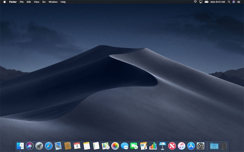
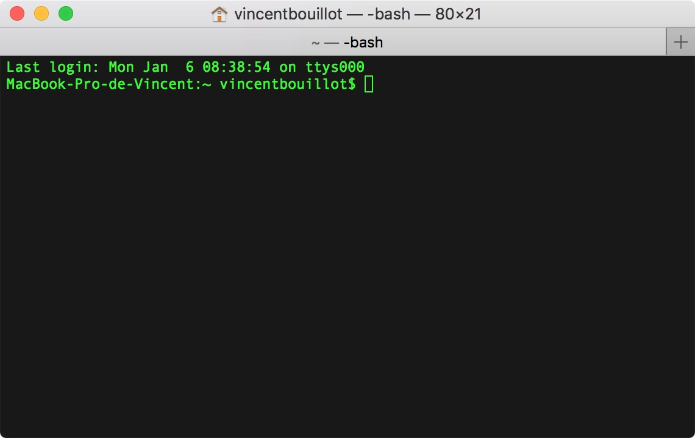
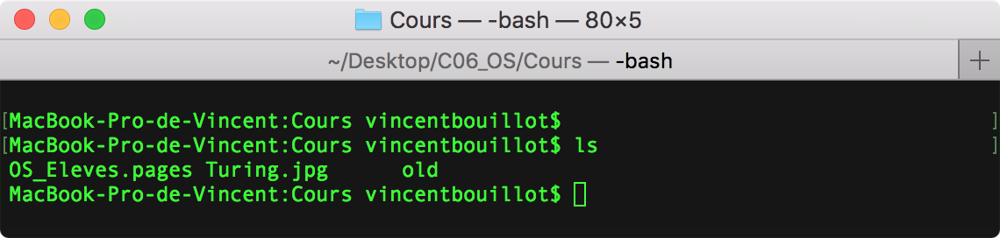
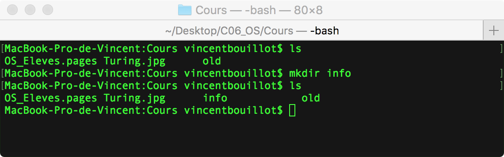
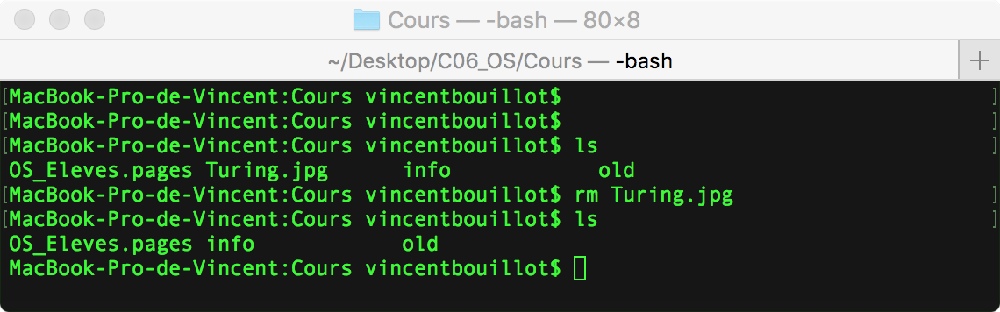
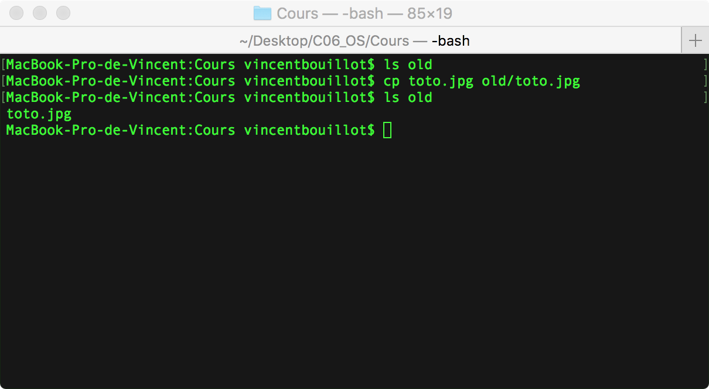

# Chapitre 10 : Systèmes d'exploitation

## Introduction

{{terminal()}}

!!! {{exercice()}}

    === "Énoncé"

        ${1: enonce}

    === "Tips"

        ${1: enonce}

	=== "Solutions"

        ${2: sol}

`#!python lambda x : x**2`

`#!latex \left( \dfrac 1x \right)^2=1`

<!-- !!! danger "Les consoles"

    === "Une console Linux"
        {{ linux(700) }}

    === "Une console python"
        {{ basthon('scripts/exo1.py', 700) }} -->

Lorem ipsum dolor sit amet, consectetur
adipiscing elit. Proin at cursus nibh,
et lobortis mauris. Sed tempus turpis
quis turpis pulvinar, ac vehicula dui
convallis. Phasellus tempus massa quam,
ac mollis libero cursus eget.
Donec convallis a nisl vitae scelerisque.
Ut vel nisl id augue ullamcorper lobortis at id dolor.

    Lorem ipsum dolor sit amet, consectetur
adipiscing elit. Proin at cursus nibh,
et lobortis mauris. Sed tempus turpis
quis turpis pulvinar, ac vehicula dui
convallis. Phasellus tempus massa quam,
ac mollis libero cursus eget.
    Donec convallis a nisl vitae scelerisque.
    Ut vel nisl id augue ullamcorper lobortis
at id dolor.

> Ceci est un texte cité. Vous pouvez répondre
> à cette citation en écrivant un paragraphe
> normal juste en-dessous !

???+ warning "Attention au Python:"
    !!! summary "Voici un code Python:"
        ```python 
        [i**2 for i in range(10)]
        ```
    !!! summary "Voici un code Python:"
        ```python linenums="1" hl_lines="1-3"
        def tableau_markdown(liste: list) -> str:
            lignes = ['|n|']+[f'{i}|' for i in range(len(liste))]+['\n']
            lignes.extend(['|']+['-|']*(len(liste)+1) +['\n'])
            lignes.extend(['|u_n|']+[f'{liste[i]}|' for i in range(len(liste))])
            print(lignes)
            return "".join(lignes)
        ```

Pour afficher des touches, on fait `++ctrl++`+`++alt++`. 

++ctrl+alt++

++"Maj"+"Entrée"++

??? info "Fichier YAML"
    ```yaml
    --8<--- "mkdocs.yml"
    ```

## Inclure un fichier Python

!!! info "Fichier Python `docs/exo1.py`"
    ```python
    --8<--- "docs/exo1.py"
    ```

`Un blabla introductif:`
:   et voilà la définition

`Un blabla plus précis:`
:   et voilà une autre définition

    et ca marche avec deux paragraphes

J'essaie les caractères Unicode : `&#127140`&#127140

La définition de la fonction `premier` commence avec le mot clé `def`

Elle prend en paramètre un entier `n`

Elle renvoie un booléen avec le mot clé `return`

Let's try some Maths : 

$$\int_0^t x^2 dx$$

$$\dfrac 12 + \mathcal{R} + \mathscr{R}$$

En 1735, Leonhard Euler résout le **problème de Bâle** en établissant la formule suivante :

$$\sum\limits_{k\in\mathbb N^*} \frac 1 {k^2} = \frac {\pi^2}6$$

Cependant, il ne démontrera rigoureusement son résultat qu’en 1741.


Résumez le contenu de la vidéo dont le lien est donné ci-dessous en rédigeant, à l'aide d'un traitement de texte, un texte de quelques lignes. Vous pourrez agrémenter votre texte avec un schéma (par exemple à l'aide d'un logiciel de dessin vectoriel comme Inkscape).

[les systèmes d'exploitation](https://youtu.be/4OhUDAtmAUo "INFOBULLE"){ .md-button }

Dans le vidéo ci-dessus, le système d'exploitation UNIX est évoqué, essayons d'en savoir un peu plus sur UNIX grâce à la vidéo suivante.

---

Résumez le contenu de la vidéo ci-dessous en rédigeant, à l'aide d'un traitement de texte, un texte de quelques lignes.

[[https://youtu.be/bdSWj7Y50VY]{.ul}](https://youtu.be/bdSWj7Y50VY)

Le système UNIX est un système dit \"propriétaire\" (certaines personnes disent \"privateur\"), c'est-à-dire un système non libre. Mais plus généralement, qu'est-ce qu'un **logiciel libre** ?

D'après Wikipédia : \"Un logiciel libre est un logiciel dont l'utilisation, l'étude, la modification et la duplication par autrui en vue de sa diffusion sont permises, techniquement et légalement, ceci afin de garantir certaines libertés induites, dont le contrôle du programme par l'utilisateur et la possibilité de partage entre individus\". Le système UNIX ne respecte pas ces droits (par exemple le code source d'UNIX n'est pas disponible, l'étude d'UNIX est donc impossible), UNIX est donc un système \"propriétaire\" (le contraire de \"libre\").

Attention qui dit logiciel libre ne veut pas forcement dire logiciel gratuit (même si c'est souvent le cas), la confusion entre \"libre\" et \"gratuit\" vient de l'anglais puisque \"free\" veut à la fois dire \"libre\", mais aussi gratuit.

En 1991, un étudiant finlandais, Linus Torvalds, décide de créer un clone libre d'UNIX en ne partant de rien (on dit \"from scratch\" en anglais) puisque le code source d'UNIX n'est pas public. Ce clone d'UNIX va s'appeler Linux (Linus+UNIX). La vidéo ci-dessous raconte l'histoire de Linux en entrant un peu plus dans les détails :{width="1.2840780839895014in" height="1.5008694225721784in"}

## Linux

Résumez le contenu de la vidéo ci-dessous en rédigeant un texte de quelques lignes.

[[https://youtu.be/IquNF_DXcF8]{.ul}](https://youtu.be/IquNF_DXcF8)

## Microsoft, macOS, systèmes propriétaires

Difficile de parler des systèmes d'exploitation sans parler de Microsoft !

Microsoft a été créée par Bill Gates et Paul Allen en 1975. Microsoft est surtout connue pour son système d'exploitation Windows.

[À l'aide de Wikipédia, recherchez l'histoire de Windows et résumez la en quelques phrases.]{.ul}

Windows est un système d'exploitation \"propriétaire\", la première version de Windows date de 1983, mais à cette date Windows n'est qu'un ajout sur un autre système d'exploitation nommé MS-DOS.

Aujourd'hui Windows reste le système d'exploitation le plus utilisé au monde sur les ordinateurs grand public, il faut dire que l'achat de Windows est quasiment imposé lorsque l'on achète un ordinateur dans le commerce. Quand vous achetez un ordinateur neuf, une partie de la somme que vous versez termine dans les poches de Microsoft. Il est toutefois possible de se faire rembourser la licence Windows, mais cette opération est relativement complexe.{width="3.247759186351706in" height="2.4629297900262466in"}{width="3.7088013998250218in" height="2.4767191601049867in"}

Enfin pour terminer, quelques mots sur le système d'exploitation des ordinateurs de marque Apple : tous les ordinateurs d'Apple sont livrés avec le système d'exploitation **macOS**. Ce système macOS est un système d'exploitation UNIX, c'est donc un système d'exploitation propriétaire.

[À l'aide de Wikipédia, recherchez l'histoire de macOS et résumez la en quelques phrases :]{.ul}

## Commandes de base en Linux

### Terminal

Quelle que soit la distribution Linux utilisée, on trouve une application appelée \"Terminal\" ou \"Console\". Jusqu'en 1996 (!) et avant l'émergence d'un système d'affichage graphique comparable à MacOS/Windows, le terminal était la seule et unique manière de naviguer entre les applications. Ce n'est plus vrai aujourd'hui. Toutefois, **maitriser le terminal est essentiel**.

Le terminal permet :

- d'accéder à des fichiers système \"invisibles\" ;
- de débugger des situations complexes ;
- de se connecter à des serveurs distants ;
- d'automatiser des tâches qui prendraient énormément de temps à la main grâce à des instructions appelées \"lignes de commande\".

---

Le même mais avec des numéros.

Le terminal permet :

1. d'accéder à des fichiers système \"invisibles\" ;
1. de débugger des situations complexes ;
    - truc
    - machin
        - machin truc
        - encore mieux  
2. de se connecter à des serveurs distants ;
3. d'automatiser des tâches qui prendraient énormément de temps à la main grâce à des instructions appelées \"lignes de commande\".


##Rem : Les lignes de commande sont interprétées par un *Shell*. Le plus courant est le Bash (Bourne Again Shell).

**Exemple** :

Dans une entreprise de 400 salariés, on veut créer un dossier *EmployéXXXX* et chaque dossier doit contenir les sous-dossiers *Administratif*, *Technique* et *Autre*. Et on veut faire cela pour chaque employé avec XXXX qui est l'identifiant du salarié.

{width="1.6844280402449694in" height="1.940871609798775in"}{width="1.6844280402449694in" height="1.940871609798775in"}

La secrétaire, sur son Windows, ferait sans doute tout cela à la main.et prendrait environ une semaine pour compléter cette tâche... Avec le Terminal, on peut faire cela en 2 minutes (le temps de trouver et d'écrire les lignes de commande).


### Down the Rabbit Hole : l'arborescence

#### Introduction

Grâce à la ligne de commande, nous allons travailler sur les **fichiers** et les **répertoires**. Dans les systèmes de type \"UNIX\" (par exemple GNU/Linux ou macOS), nous avons un système de fichier en arborescence comme indiqué ci-dessous :{width="4.023265529308836in" height="3.546233595800525in"}

Dans le schéma ci-dessus on trouve des répertoires (noms entourés d'un rectangle, exemple : \"home\") et des fichiers (uniquement des noms \"grub.cfg\").

##Rem : les extensions des noms de fichiers (le \"cfg\" de \"grub.cfg\") ne sont pas obligatoires dans les systèmes \"UNIX\". Par exemple, \"bash\" est bien un nom de fichier et il n'a pas d'extension.

On parle d'arborescence, car ce système de fichier ressemble à un arbre à l'envers.

[Définition :]{.ul} la **base** de l'arbre s'appelle la **racine** de l'arborescence et se représente par un \"**/**\" .

***b. Chemin absolu et chemin relatif***

Pour indiquer la position d'un fichier (ou d'un répertoire) dans l'arborescence, il existe 2 méthodes : indiquer un chemin absolu ou indiquer un chemin relatif.

Le chemin absolu indique le \"chemin\" depuis la racine. Par exemple, le chemin absolu du fichier fiche.ods sera : /home/elsa/documents/fiche.ods

##Rem : nous démarrons bien de la racine \"/\" .

Il est possible d'indiquer le chemin non pas depuis la racine, mais depuis un répertoire quelconque, nous parlerons alors de chemin relatif. Le chemin relatif permettant d'accéder au fichier \"photo_1.jpg\" depuis le répertoire \"max\" est : \"images/photo_vac/photo_1.jpg\"

##Rem : Le \"/\" au début du chemin est absent dans un chemin relatif. Cela nous permettra de distinguer un chemin relatif d'un chemin absolu.

À présent, nous désirons indiquer le chemin relatif pour accéder au fichier \"gdbd_3.jpg\" depuis le répertoire \"photos_vac\". Quel serait le problème ?

*Il faut \"remonter\" d'un \"niveau\" dans l'arborescence pour se retrouver dans le répertoire \"images\" et ainsi pouvoir repartir vers la bonne \"branche\".*

Pour ce faire il faut utiliser 2 points : \"../ski/gdbd_3.jpg\"

##Rem : Il est tout à fait possible de remonter de plusieurs \"crans\" : \"../../\" depuis le répertoire \"photos_vac\" permet de \"remonter\" dans le répertoire \"max\"

[Exercice 1 :]{.ul}

En vous basant sur l'arborescence ci-dessus, déterminez le chemin **absolu** permettant d'accéder au fichier :

-   \"bash\"

-   \"rapport.odt\"

Toujours en vous basant sur l'arborescence ci-dessus, déterminez le chemin **relatif** permettant d'accéder au fichier :

-   \"rapport.odt\" depuis le répertoire \"elsa\"

-   \"fiche.ods\" depuis le répertoire \"boulot\"

-   \"gdbd_3.jpg\" depuis \"boulot\"

**Rem :** les systèmes \"UNIX\" sont \"sensibles à la casse\" (majuscules ≠ minuscules) : le répertoire \"aBBa\" et le répertoire \"aBbA\" sont deux répertoires différents.

1)  ##Découvertes des commandes de base

Il existe de très nombreuses commandes interprétables par Bash et celles-ci ont un nombre encore plus important d'options possibles ! Pour consulter la documentation d'une commande, on tape : **man** commande

##Rem : Pour quitter la page de documentation, on appuie sur q.

**Téléchargez le fichier C10_OS.zip** à partir de [[bouillotvincent.github.io]{.ul}](http://bouillotvincent.github.io) et chargez-le sur CoCalc en allant sur \"Files\", \"Upload\" (à droite). Vous pouvez extraire l'archive en cliquant dessus ou via la ligne de commande si vous vous souvenez comment faire...

Allez sur CoCalc.com. Choisissez{width="4.103033683289588in" height="2.591389982502187in"} \"New\" puis \"\_Linux Terminal\". Vous devriez avoir quelque chose qui ressemble vaguement à cela :

Nous avons ci-contre le terminal de l'utilisateur \"vincentbouillot\" qui utilise un ordinateur qui se nomme \"MacBook-Pro-de-Vincent.

Écrivez ci-dessous quel est votre nom d'utilisateur et comment s'appelle votre Terminal :

***La commande ls***

À l'aide de \"man ls\", dire ce que permet de faire la commande ls :

*La commande \"ls\" permet de lister le contenu du répertoire courant.*{width="4.757240813648294in" height="1.1350612423447068in"}

Dans l'exemple ci-dessus, dans le répertoire \"Cours\" de l'utilisateur \"vincentbouillot\", nous affichons le contenu du répertoire courant. Dans ce répertoire, il y a un fichier .pages, un fichier .jpg, un fichier .pdf et un répertoire old.

Dans le terminal, utilisez la commande ls pour lister les fichiers et répertoires présents :

***La commande cd***

La commande \"cd\" permet de changer de répertoire courant et donc de naviguer dans l'arborescence. Il suffit d'indiquer le chemin (relatif ou absolu) qui permet d'atteindre le nouveau répertoire :

Par exemple (en utilisant l'arborescence du début) :

-   si le répertoire courant est le répertoire \"elsa\" et que vous \"voulez vous rendre\" dans le répertoire \"documents\", il faudra saisir la commande : \"cd documents\" (relatif) ou \"cd /home/elsa/documents\" (absolu)

-   si le répertoire courant est le répertoire \"photos_vac\" et que vous \"voulez vous rendre\" dans le répertoire \"ski\", il faudra saisir la commande : \"cd ../ski\" (relatif) ou \"cd /home/max/images/ski\" (absolu)

-   si le répertoire courant est le répertoire \"boulot\" et que vous \"voulez vous rendre\" dans le répertoire \"documents\", il faudra saisir la commande : \"**cd ..**\" (relatif) ou \"cd /home/elsa/documents\" (absolu)

[Exercice 2 :]{.ul}

Toujours en utilisant l'arborescence du début, quelle est la commande à saisir si le répertoire courant est le répertoire \"home\" et que vous \"voulez vous rendre\" dans le répertoire \"boulot\" (vous utiliserez d'abord un chemin absolu puis un chemin relatif)

En utilisant des ls et des cd, déplacez-vous jusqu'à atteindre le sous-dossier \"Cours\" du dossier \"C10_OS\". Retrouvez-vous bien l'affichage de la page précédente ? .....................

***La commande pwd***

À l'aide de \"man pwd\", dire ce que permet de faire la commande pwd :

*La commande \"pwd\" permet d'obtenir le chemin absolu du répertoire courant.*

Quel est le chemin absolu du répertoire \"Cours\" dans lequel vous vous situez ?

En déduire le chemin relatif du répertoire \"Cours\" depuis votre répertoire \"home\".

##Rem : Si vous êtes perdu dans votre arborescence, \"pwd\" vous permet de savoir où vous êtes !

***La commande mkdir***

La commande \"mkdir\" permet de créer un répertoire dans le répertoire courant. La commande est de la forme \"mkdir nom_du_répertoire\"{width="4.36159886264217in" height="1.3620428696412947in"}

Déplacez-vous dans le dossier \"Cours\" et créez un répertoire appelé \"info\". Un ls doit vous renvoyer :

##Rem : il est préférable de ne pas utiliser de caractères accentués dans les noms de répertoire ou de fichier. De même, les espaces sont remplacés par des underscore \"\_\" .

[Exercice 3 :]{.ul}

Revenez sur votre bureau à l'aide de cd .. (ou de \_\_\_\_\_\_\_\_\_\_\_ si vous vous en souvenez...) et grâce aux lignes de commande, créez une petite arborescence correspondant à celle ci-dessous :

***La commande rm***

La commande \"rm\" permet de supprimer un fichier ou un répertoire. La commande est de la forme \"rm nom_du_répertoire_ou_nom_du_fichier\".

Retourner dans le répertoire \"C10_OS/Cours\" et à l'aide de la commande rm, supprimez le fichier Turing.jpg. À l'aide d'un ls, vérifiez que votre fichier est bien supprimé :{width="5.497103018372703in" height="1.7166393263342081in"}

À l'aide de la commande rm, supprimez le répertoire info. Que se passe-t-il ?

La plupart des commandes UNIX peuvent être utilisées avec une ou plusieurs options.

Par exemple, pour supprimer un répertoire, il est nécessaire d'utiliser la commande \"rm\" avec l'option \"-r\" : \"rm -r nom_du_répertoire\"

Supprimez à présent le répertoire \"info\".

[Exercice 4 :]{.ul}

En utilisant l'instruction \"**cd \~**\" , retournez sur votre home en une instruction. Puis, en une instruction également, retournez dans le répertoire \"Bureau\", \"Vacances\" puis \"Photo\". **On peut utiliser des tabulations pour afficher les répertoires potentiellement accessibles via cd**.

Grâce à l'instruction rm, supprimez le répertoire \"191231\" : les photos du Réveillon, c'est trop dangereux...

***La commande touch***

La commande \"touch\" permet de créer un fichier vide. La commande est de la forme \"touch nom_du_fichier_à\_créer\". Elle permet aussi de changer la **date de dernière modification** d'un fichier (ca commence à devenir intéressant...).

Retourner dans le répertoire \"C10_OS/Cours\" (ca devrait commencer à rentrer...) et créez un fichier vide toto.jpg .

Effectuer la commande \"ls -l\". À quoi correspondent toutes ces colonnes ?

Faire un touch sur OS_Eleves.pages, puis refaire la commande \"ls -l\". Que constatez-vous ?

***La commande cp***

La commande \"cp\" permet de copier un fichier. La commande est de la forme :

\"cp répertoire_source/nom_fichier_à\_copier répertoire_destination/nom_fichier\"{width="7.0866765091863515in" height="1.7091010498687664in"}

##Rem : le nom du fichier \"destination\" n'est pas obligatoirement le même que le nom du fichier \"source\" (on peut avoir \"cp toto.jpg info/avengers.avi\")

[Exercice 8 : La secrétaire en galère]{.ul}

Reprenons notre exemple initial de la secrétaire qui doit **créer** un dossier EmployeXXXX pour les 400 employés de l'entreprise, chaque dossier **devant contenir** 3 sous-dossiers : Administratif, Technique, Autre. Les salariés sont représentés par des numéros allant de 0001 à 0400 (on pourrait disposer d'une liste avec leurs noms, ce serait exactement pareil). Pour générer cette arborescence, on va utiliser un **script bash,** qui sera **exécutable**.

Déplacez-vous dans Activités : quels fichiers trouvez-vous ?

*le zip, un dossier et un jpg*

À l'aide de \"ls -l\", déterminez quelles sont les deux familles de \"fichiers\" présents :

*On a des fichiers et des dossiers. Les dossiers commencent par d.*

Écrivez ci-dessous la liste d'instructions (mkdir, cd, ls, cp etc.) permettant de créer le dossier et les sous-dossiers de **l'employé0001** et testez ces instructions sur l'ordinateur.

*mkdir Employe0001*

*mkdir Employe0001/Autre*

*mkdir Employe0001/Administratif*

*mkdir Employe0001/Technique*

Intégrer votre liste d'instructions dans le script afin de générer les 10 premiers dossiers. Vérifiez que votre arborescence fonctionne.

Si ce n'est pas le cas, supprimez tout ce que vous avez créé à l'aide de **rm -r Employe\*** (l'étoile permet de supprimer tous les dossiers commençant par Employe) et reprenez l'étape précédente.

Sinon, généralisez à 400 employés.

Que remarquez-vous dans ce script ? Y-a-t'il des choses que vous connaissez déjà ?

*Il y a une boucle comme en Python ! Printf et echo semblent afficher des choses même si on ne comprend pas bien comment fonctionne printf.*

[\
]{.ul}

4)  ##Gestion des utilisateurs et des groupes

Les systèmes UNIX sont des systèmes multi-utilisateurs : plusieurs utilisateurs peuvent partager un même ordinateur, chacun disposant d'un environnement de travail qui lui est propre.

Chaque utilisateur possède certains droits lui permettant d'effectuer certaines opérations et pas d'autres. Un utilisateur particulier est autorisé à modifier tous les droits : ce \"super utilisateur\" est appelé \"administrateur\" ou \"root\".

Pour un fichier ou un répertoire, le système d'exploitation permet de gérer les droits d'utilisation selon trois catégories :

-   utilisateur (symbolisé par la lettre u = user)

-   groupe d'utilisateur (symbolisé par la lettre g = group)

-   reste du monde (symbolisé par la lettre o = others)

De plus, les fichiers et les répertoires possèdent 3 types de droits :

-   les droits en lecture (symbolisés par la lettre r = Read) : est-il possible de lire le contenu de ce fichier ?

-   les droits en écriture (symbolisés par la lettre w = Write) : est-il possible de modifier le contenu de ce fichier ?

-   les droits en exécution (symbolisés par la lettre x = eXecute) : est-il possible d'exécuter le contenu de ce fichier (quand le fichier du code exécutable) ?

[Rappel :]{.ul} Il est possible d'utiliser la commande \"ls\" avec l'option \"-l\" afin d'avoir la majorité des informations concernant un fichier.

[Exercice 9 :]{.ul}

Effectuer un ls -l dans C10_OS/Cours . Observez la première colonne d'informations et réécrivez ci-dessous les symboles que vous obtenez :

Dans mon cas :

total 3088

-rwxr-xr-x@ 1 vincentbouillot staff 369K 27 nov 23:00 **OS_Eleves.pages**\*

-rwxr-xr-x@ 1 vincentbouillot staff 1,1M 6 jan 23:19 **OS_Prof.pages**\*

-rw-r\--r\--@ 1 vincentbouillot staff 80K 6 jan 21:22 Turing.jpg

drwxr-xr-x@ 2 vincentbouillot staff 64B 6 jan 21:24 **old**/

Lisons la première ligne de gauche à droite :

- le premier symbole \"-\" signifie que l'on a affaire à un fichier, dans le cas d'un répertoire, nous aurions un \"d\" (voir la 2e ligne)
- les 3 symboles suivants \"rwx\"donnent les droits du propriétaire du fichier : lecture autorisée (r), écriture autorisée (w), exécution autorisée (x)
- les 3 symboles suivants \"r-x\"donnent les droits du groupe lié au fichier : lecture autorisée (r), écriture interdite (- au lieu de w), exécution autorisée (x)
- les 3 symboles suivants \"r-x\"donnent les droits des autres utilisateurs : lecture autorisée (r), écriture interdite (- au lieu de w), exécution autorisée (x)
- le caractère suivant \"1\" donne le nombre de liens (nous n'étudierons pas cette notion ici)
- le premier \"vincentbouillot\" représente le nom du propriétaire du fichier
- le second \"staff\" représente le nom du groupe lié au fichier

[Exercice 10 :]{.ul}

De la même manière, étudiez la quatrième ligne concernant **old/**

*Lisons la première ligne de gauche à droite :*

*\"d\" : c'est un répertoire*

*les 3 symboles suivants \"rwx\"donnent les droits du propriétaire du fichier : lecture autorisée (r), écriture autorisée (w), exécution autorisée (x)*

*les 3 symboles suivants \"r-x\"donnent les droits du groupe lié au fichier : lecture autorisée (r), écriture interdite (- au lieu de w), exécution autorisée (x)*

*les 3 symboles suivants \"r-x\"donnent les droits des autres utilisateurs : lecture autorisée (r), écriture interdite (- au lieu de w), exécution autorisée (x)*

*le caractère suivant \"2\" donne le nombre de liens : pour un dossier, c'est en gros le nombre de sous-fichiers et dossiers contenus dans le dossier.*

*le premier \"vincentbouillot\" représente le nom du propriétaire du fichier*

*le second \"staff\" représente le nom du groupe lié au fichier*

*Ensuite vient la taille en octet*

*Finalement, la date de création.*

##Définition : modification des permissions d'un fichier

Le propriétaire d'un fichier peut modifier les permissions d'un fichier ou d'un répertoire à l'aide de la commande \"chmod\" ayant la syntaxe suivante:

```bash
chmod \[u g o a\] \[+ - =\] \[r w x\] nom_du_fichier
```

Ceci est un code Python ==très== important :
```python
def f(x):
  return x**2 + 2
```

Une liste de tâches

- [ ] à faire
- [x] fini
- [ ] presque
- [x] fait depuis longtemps

```python
JEU_52 = (
    '🂡🂢🂣🂤🂥🂦🂧🂨🂩🂪🂫🂭🂮',
    '🂱🂲🂳🂴🂵🂶🂷🂸🂹🂺🂻🂽🂾',
    '🃁🃂🃃🃄🃅🃆🃇🃈🃉🃊🃋🃍🃎',
    '🃑🃒🃓🃔🃕🃖🃗🃘🃙🃚🃛🃝🃞',
    '🂠🂬🂼🃌🃜🃏🃟'
    )
```

!!! info "Pourquoi ?"
    Elles permettent de délimiter des blocs de contenu
     avec une touche de couleur, sans créer de nouvelles
     entrées dans la table des matières.

    Elles structurent donc sans alourdir les onglets de navigation.

##Rem :

-   \"u\" correspond au propriétaire, \"g\" correspond au groupe lié au fichier (ou au répertoire), \"o\" correspond aux autres utilisateurs et \"a\" correspond à \"tout le monde\" .

-   \"+\" ajoute une permission, \"-\" retire une permission

-   \"r\" : lecture, \"w\" : écriture, \"x\" : exécution.

[Exemple :]{.ul}

chmod g+x monfichier.txt

donne les droits d'exécution au groupe sur le fichier monfichier.txt.

chmod u-wr monfichier.txt

retire les droits d'écriture et de lecture à l'utilisateur sur le fichier monfichier.txt.

chmod u=wr,g=r,o= monfichier.txt

donne les droits d'écriture et de lecture à l'utilisateur et les droits de lecture au groupe sur le fichier monfichier.txt.

[Exercice 11 :]{.ul}

Dans le répertoire Desktop, créez deux répertoires appelés \"Vacances\" et \"Travail\". Dans le répertoire Vacances, créez un fichier toto.jpg à l'aide de touch.\
Que s'affiche-t-il avec ls -l ?

*-rw-r\--r\-- 1 vincentbouillot staff 0 10 mai 20:56 toto.jpg*

Ajoutez des droits en écriture à tous les utilisateurs. Que s'affiche-t-il avec ls -l ?

*chmod a+w toto.jpg*

*ls -l toto.jpg*

*-r**w**-r**w**-r**w**- 1 vincentbouillot staff 0 10 mai 20:56 toto.jpg*

Retirez les droits en écriture aux utilisateurs invités. Que s'affiche-t-il avec ls -l ?

*chmod o-w toto.jpg*

*ls -l toto.jpg*

*-rw-rw-r**-**- 1 vincentbouillot staff 0 10 mai 20:56 toto.jpg*

Donnez les droits en écriture à tout le monde, les droits en lecture aux invités et les droits d'exécution au créateur du fichier en une ligne ! Vérifiez votre réponse avec ls -l.

*chmod a=w,o=r,u=x toto.jpg*

*ls -l toto.jpg*

*\-\--x-w-r\-- 1 vincentbouillot staff 0 10 mai 20:56 toto.jpg\**

[Exercice 12 :]{.ul}

Créez un répertoire \"test_NSI\" dans votre répertoire personnel. Placez-vous dans le répertoire \"test_NSI\". Créez un fichier \"toto.txt\", vérifiez les permissions associées à ce fichier. Modifiez les permissions associées au fichier \"toto.txt\" afin que le groupe ait la permission \"lecture et exécution\" et les \"autres utilisateurs\" aient la permission \"écriture\".

[Exercice 13 : Permission et code octal :]{.ul}

Les droits peuvent également s'écrire et se modifier grâce à une notation en base 8 (octal). Par exemple, les droits en écriture symbolique :

rwx \--x r-x

se traduisent par 111 001 101 en binaire, soit 715 en octal.

chmod 715 monfichier.txt donne alors directement ces droits au fichier.

En octal, comment se traduit \--x \--x \--x ? 111

rwx rwx rw- ? 776

Quels droits correspondent à 654, à 755 ? rw- r-x r\-- et rwx r-x r-x

Pour faire le point et à l'aide du cours, compléter le tableau ci-dessous :

## Récapitulatif:

|n|0|1|2|3|4|5|6|7|
|-|-|-|-|-|-|-|-|-|
|u_n|0|1|1|2|3|5|8|13|

| Commande | Description | Exemple |
|:---------:|------------------------------|-----------------|
| pwd     | indique le chemin absolu vers le répertoire actif
| ls      | liste le contenu d'un répertoire
| cp      | copie un fichier ou un répertoire (option -r) vers un autre répertoire
| mv      | déplace un fichier ou un répertoire (option -r) vers un autre répertoire
| rm      | supprimer **définitivement** un fichier ou un répertoire (option -r) 
| mkdir   | crée un répertoire
| cd      | se déplace à l'adresse relative ou absolue indiquée
| cat     | affiche le contenu d'un fichier
| touch   | crée un fichier ou modifie la date de dernière modification d'un fichier
| chmod   | change les permissions d'un fichier ou dossier
